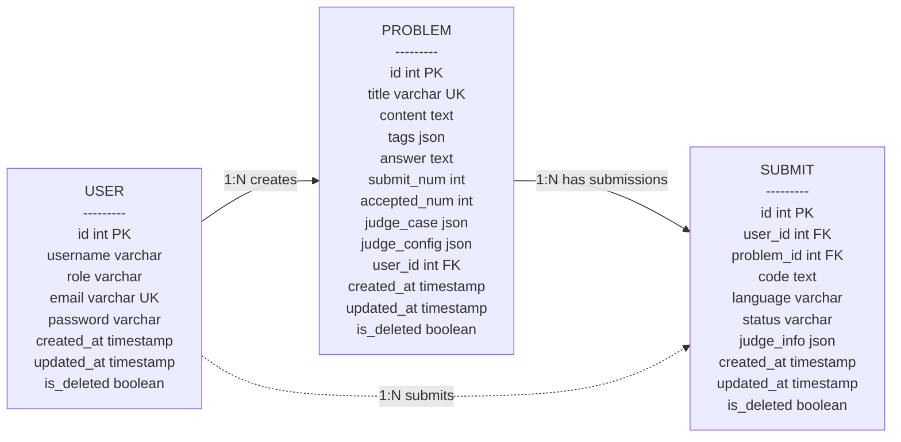

# 在线判题系统 ER 图

> 根据 `src/schema/*.schema.ts` 中的 Drizzle MySQL Schema 生成。
> 当前代码中 `user_id`、`problem_id` 仅定义了索引，未定义数据库级外键；下图关系按字段语义推导。

## 实体说明

| 实体 | 数据表 | 说明 |
| --- | --- | --- |
| 用户 | `user` | 系统用户，包含账号、角色、邮箱、密码和软删除字段。 |
| 题目 | `problem` | 在线判题题目，包含题面、标签、题解、判题用例、判题配置和统计字段。 |
| 提交 | `submit` | 用户对题目的代码提交记录，包含代码、语言、判题状态和判题结果。 |

## 关系说明

| 关系 | 基数 | 关联字段 | 说明 |
| --- | --- | --- | --- |
| 用户 - 题目 | 1:N | `problem.user_id` → `user.id` | 一个用户可以创建多个题目。 |
| 用户 - 提交 | 1:N | `submit.user_id` → `user.id` | 一个用户可以产生多条提交记录。 |
| 题目 - 提交 | 1:N | `submit.problem_id` → `problem.id` | 一个题目可以拥有多条提交记录。 |

## 索引与约束

| 数据表 | 字段 | 类型 | 说明 |
| --- | --- | --- | --- |
| `user` | `id` | 主键 | 自增主键。 |
| `user` | `email` | 唯一约束 | 邮箱唯一。 |
| `problem` | `id` | 主键 | 自增主键。 |
| `problem` | `title` | 唯一约束 | 题目标题唯一。 |
| `problem` | `user_id` | 普通索引 | 加速按创建用户查询题目。 |
| `submit` | `id` | 主键 | 自增主键。 |
| `submit` | `user_id` | 普通索引 | 加速按用户查询提交。 |
| `submit` | `problem_id` | 普通索引 | 加速按题目查询提交。 |
